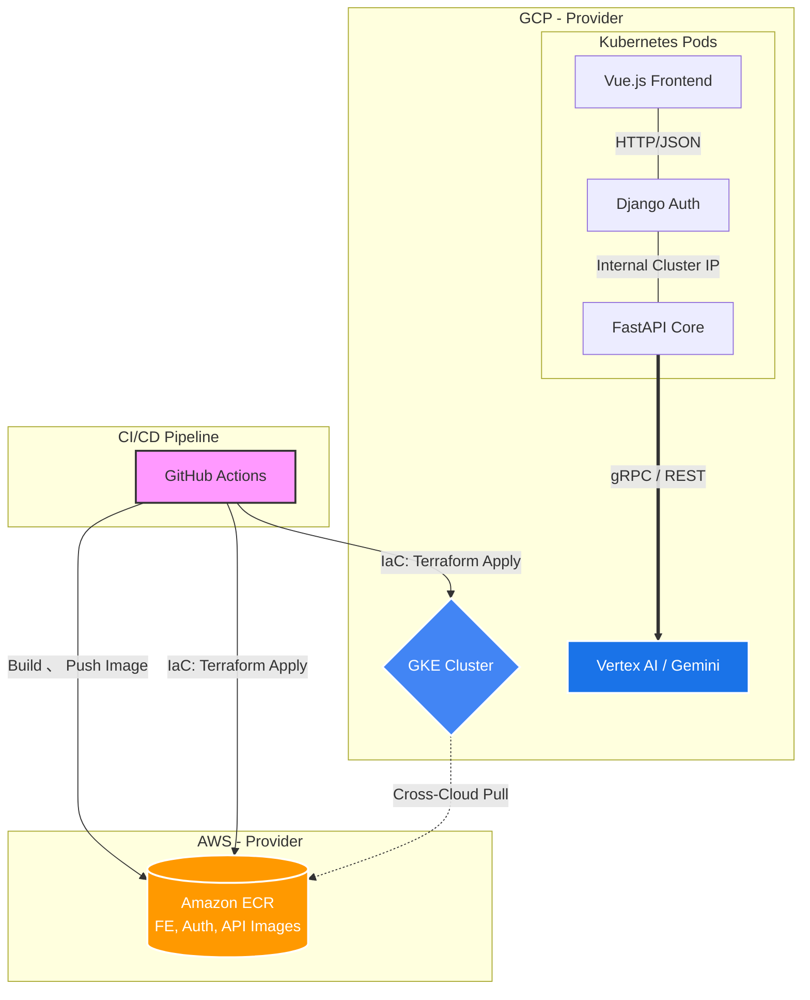

# microservice-tf-provisioning

## Project Introduction

A multi-cloud IaC project using Terraform to provision AWS ECR and GCP GKE for a containerized AI translation microservice architecture.

本專案利用 Terraform 實現基礎設施即代碼 (IaC)，將底層架構橫跨 AWS 與 GCP 兩大雲端平台。系統採用標準微服務架構設計，前端具備 Vue.js 打造的使用者介面，後端則解耦為 Django 負責的會員認證系統，以及 FastAPI 負責的核心翻譯 API (串接 GCP Gemini)。
全系統透過 Docker 容器化並部署至 Kubernetes (GKE) 上運行，結合 GitHub Actions 實現自動化 CI/CD 流水線。

## Architecture & Design Decisions

為確保系統的高可用性、模組化與自動化管理，本專案採用以下架構設計：

*   **Microservices Architecture (微服務架構)**：
    將系統拆分為 Frontend (Vue)、Auth Service (Django) 與 API Service (FastAPI)。此設計落實了關注點分離，使各服務能獨立開發、測試與擴展。
*   **Continuous Integration / Continuous Deployment (GitHub CI/CD)**：
    發起 Pull Request 時，Pipeline 自動觸發 `terraform plan` 進行環境變更預覽；合併至 main 分支後，自動執行 `terraform apply` 進行跨雲資源部署與應用程式更新。
*   **Infrastructure as Code (Terraform)**：
    統一管理 AWS 與 GCP 的雙邊資源，實現環境配置的版本控管、可重複性與一致性。
*   **Image Management (AWS ECR)**：
    利用 AWS Elastic Container Registry (ECR) 統一存放與管理編譯完成的三個微服務 Docker 映像檔。
*   **Container Orchestration (GCP GKE)**：
    透過 Google Kubernetes Engine (GKE) 作為核心運算平台，負責微服務間的網路路由 (Service Discovery)。運用 Kubernetes 的自我修復 (Self-healing) 與零停機部署 (Rolling Update) 特性，確保系統穩定運行。
*   **AI Service Integration (GCP Vertex AI)**：
    FastAPI 服務於 GCP 內網環境中直接呼叫 Gemini 大型語言模型，處理應用程式的翻譯請求，降低網路延遲並提升架構整合度。

## Tech Stack

*   **IaC & CI/CD**: Terraform, GitHub Actions
*   **Cloud Providers**: AWS (ECR), GCP (GKE, Vertex AI)
*   **Containerization**: Docker, Kubernetes(k8s)
*   **Frontend**: Vue.js
*   **Backend Services**: Python (Django for Auth, FastAPI for Core API)

## Directory Structure

```text
.
├── .github/workflows/   # GitHub Actions CI/CD pipelines
├── frontend/            # Vue.js application & Dockerfile
├── services/
│   ├── auth/            # Django authentication service & Dockerfile
│   └── api/             # FastAPI translation service & Dockerfile
├── k8s/                 # Kubernetes manifests (Deployments, Services, Ingress)
└── terraform/           # Terraform configuration files (AWS & GCP)
```


